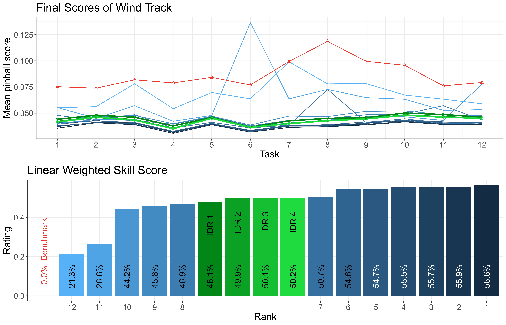

# IDR-on-GEFCom14

## Goal
Examine performance of Isotonic Distributional Regression (IDR) models (based on CRAN package "isodistrreg", or see https://github.com/AlexanderHenzi/isodistrreg) in GEFCom14 forecasting competition.
A comparison with the advanced (and tailored) methods of GEFCom14 participants allows us to get a realistic assessment of the predictive abilities of IDR in probabilistic energy forecasting.

## Isotonic Distributional Regression (IDR) [1]

Isontonic Distributional Regression (IDR) was introduced by Henzi et al. as "powerful nonparametric
technique for the estimation of conditional distributions under order restrictions"
(p.1) [1]. It can be used to estimate conditional cumulative distribution functions (distributional regression!)
of a response variable given realizations of explanatory variables and also predict
conditional CDFs for newly observed explanatory variable values.

In above plot IDR was applied on bivariate training data. The model provides us
with conditional CDF estimates for every x-value in the training data 
(color gradient is based on the x-value of the training data and helps us to identify
respective CDF estimates). Predictions (like the one issued for x=5) correspond
to mixtures of estimated conditional CDFs belonging to "close" explanatory variable
realizations in the training data.

The key assumption of IDR is isotonicity, which is  mathematically defined with 
partial orders. This order allows us to find "close" explanatory variable values
to issue predictions. Essentially, isotonicity means that the response variable 
assumes larger values with  higher probability if the explanatory variables assume 
larger values. This seems to be given in the training data plot above as the point
cloud has an upward trend.

Below, we can compare estimated confidence bands for two synthetic
bivariate training data point clouds. The isotonictiy assumption of IDR is
crucial to harness its full predictive abilities.

IDR can easily be used with more than one explanatory variable. For isotonicity,
we should look again for variables that impact the response variable positively
(negative relations can be inverted) except for variations due to unknown
quantities. Theoretically, one could contemplate more in-depth the underlying 
partial order (for single real-valued explanatory variables the total order on
the real values is used), but with the component-wise order there is a useful 
option predefined. This order has the drawback that the fraction of comparable
elements decays exponentially.

## Global Energy Forecasting Competition 2014 (GEFCom14) [2]

The Global Energy Forecasting Competition 2014 (GEFCom14) was an international
and public probabilistic energy forecasting competition. It is covered in Hong
et al. [2] and the used data as well as the results of the best contestants, and
the leaderboard can be found it the online appendix of this paper.

Participants could take part in solar power, wind power, electricity price and
electric load forecasting (the four so-called tracks of GEFCom14). Each track
featured 15 succeeding tasks (3 "initial tuning" tasks and 12 evaluated tasks)
with incremental data, in which hourly {1,2,3,...,99}% quantiles of the response 
variable had to be predicted.

Forecasts were evaluated by averaging pinball scores for each task. After 
dealing with missing and flawed predictions these mean pinball scores per task 
were translated in skill scores per task for each participant. This was done by
calculating the percentual improvements over the mean pinball scores of a 
benchmark forecast. The final rating corresponds to a linearly weighted average
of the 12 skill scores. The last task was weighted 12-times as much as the first
task.

## Repository
- *simulateCompetition.R*:  Given a prediction and quantile scoring function make predictions with it and calculate scores for all tasks of a given track of GEFCom 14
- *loadData.R, preprocess.R*:  Load and assemble data for a given track and task of GEFCom14 in a unified format, apply transformations after data was loaded (e.g., feature extraction / engineering)
- *applyIDR.R*:  provide wrappers to apply IDR in a variety of different ways
- *util.R*:  Define global variables, help functions, GEFCom14 benchmark predictions and data grouping methods
- *idr_intro.R*:  explore IDR on simulated data and visualize important properties
- *plot.R, exploreData.R, PlotsForThesis*:  visualize and analyze data

## Results

IDR can be used competitively for probabilistic energy forecasting. The simple
IDR models ("IDR 1") perform already very well. They use just one explanatory
variable (current surface solar radiation downwards (solar), wind speed (wind),
forecasted load (price), temperature (load)) plus a winter-summer split for the
load track. Apart from the wind track the performance can be improved substantially
by incorporating more explanatory variables, working with separate models on 
grouped data (like the winter-summer split), and using subagging (predefined in IDR package).

## References

 - [1]   A. Henzi, J. F. Ziegel, and T. Gneiting, "Isotonic distributional regression," *Journal of the Royal Statistical Society: Series B (Statistical Methodology)*, in press, 2021.

 - [2]   T. Hong, P. Pinson, S. Fan, H. Zareipour, A. Troccoli, and R. J. Hyndman, "Probabilistic energy forecasting: Global Energy Forecasting Competition 2014 and beyond," *International Journal of Forecasting*, vol. 32, no. 3, pp. 896-913, 2016.
